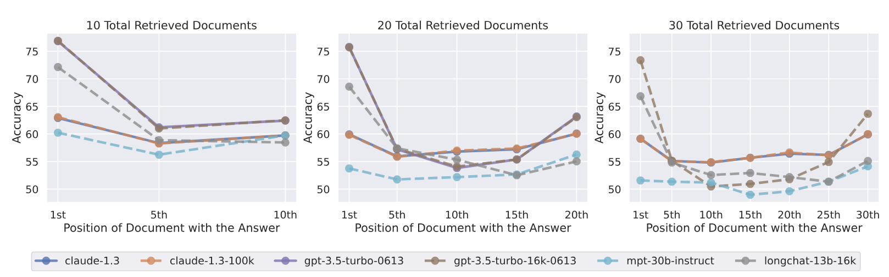

# llm-project: Document Summarisation

## Project Journal

## Goals

- ### Summarising News Articles

## General Structure:

- Provide a text file (maybe later: PDF or text files)
- Removes stop words
- Create topics; return key topics
- Challenge - could it have some generative properties? e.g. "This is is about [Requirements 1 and 2] but [Requirement 3] has [context] which is important, or may be ignored depending on [Challenge 1]"

## Learnings from initial research (Below)

- One of the biggest challenges I will face in document summarisation is the Lost in the Middle problem: Summarisation from middle parts of input documents tends to be worse than from the beginning and end.
    - This can be remedied by splitting the document into chunks and chaining output prompts from previous chunks into the next (Chain Summarisation). A summary is generated for each chunk and these intermediate summaries are then combined and further summarized, iteratively producing increasingly concise versions of the text. The process "chains" together multiple summarization steps, with each step feeding into the next, ultimately leading to a summary that encapsulates the key points of the entire document.
    - Segments of 6 to 9 pages in length (4 to 6k token input) is a good starting point. This aligns with lots of models limited token inputs which is about 4 - 16k when using GPT4, which provides good results in a number of similar tasks without taking the time to fine tune the pretrained model.

- You'll often have to specify a token output limit too - a 20:1 ratio of input to output tokens is a good place to start and models like chatGPT won't usually exceed 2k context token output.
    - Don't chase a big token limit LLM - the research shows the larger token limit 'upgrade' model degrades nearly identically in performance of its 'junior' sibling and longer documents consistently cause poorer performance.

- Look at the different types of summarisations you could do:
    - Extractive vs Abstractive
    - In Abstractive: free form summary or concept/principle based?

- ChatGPT 4 has generally good performance with the right prompt sequence given explicit structures. This is true without fine-tuning or custom GPT training - the added benefit of that appears to be marginal at this time when you trade off the further work needed to train the GPT in a specific domain.

- How do we get these summaries as close to human judged summaries as possible? Extract-then-Evaluate has gotten much better alignment between LLM and human expert evaluation of summaries. Instead of comparing the original document (x) to the model-generated summary of it, you extract key semantically important sentences (x') and compare it to that, which is a lower computational cost as well.

## Sources for Research:

### Article 1: [A very Long Discussion of Legal Document Summarization using LLMs (Aug 2023)](https://www.linkedin.com/pulse/very-long-discussion-legal-document-summarization-using-leonard-park/)
Key Takeaways:
- **Large Documents are hard to summarise due to Context Length Limitation**. There are **limited token inputs** for most models, most are around 4.1k - 16.4k (depending on model, as of August 2023), about 6 - 26 pages. If the input document creates more tokens that the model limit allows, sections need to be removed before the model can process it. 
    - This is referred to as the **context**, e.g. **8k or 4k context**.
    - Some models have much larger limits e.g. 32k, Clause v2 has a 100k token limit but it doesn't actually change performance (see below).

- **Currently, all model performance degrades as the amount of text you provide to them increases**.
    - This is **Particularly true in the middle of text** [Lost in the Middle, Nov 2023](https://arxiv.org/abs/2307.03172) "We observe that performance is often highest when relevant information occurs at the beginning or end of the input context, and signiciatly degrades when models must access information in the middle of long contexts, **even for explicitly long-context models**". So optimal performance in current models meant moderating the model input with each API call.
    - See images below: GPT 3.5 and Claude 1.3 9k and 100k both degrade nearly identically. Retrieval of information is better in the beginning and end of the context window.
    - It's very noticeable that **even when these models have substantially larger token limits (GPT 4k or 16k, Claude 8k or 100k) their performances are nearly identical to their 'lightweight' models.** All the models have better performance at the beginning and end of the context window, and a degradation in the middle. Larger context models are more convenient but optimal performance involves smaller chunks of information.

    
    

- **LLMs struggle with domain specificity and are "reality agnostic"**.
    - E.g. ChatGPT is just probabilistically generating the next word you expect, so when LARGE language model training is likely to come from general purpose sources (the LARGE majority of its training data), it's not reasonable to expect the highest probability output to be for the niche expert view that requires domain specific or interdisciplinary knowledge.
    - This **can be employed as a strategy in domain-specific uses**. e.g. Patent law - you can't expect a model to produce language to defend your unique patent but you could see the claim language of similar articles, or a generalised version of a claim you might want to distinguish from. In other words, if you are going for uniqueness, use the model as a norm to deviate from. 

- **Get Around Context Limits**
    - **Chain Prompting:** Executing many separate prompts in sequence. This breaks up large documents into pieces and iteratively process them using the LLM.
        - E.g. **LangChain "Refine Chain and Map Reduce** LangChain can be buggy and outdated (in Aug 2023) but it introduces key concepts. See Article 3

- **Documents chunked by Chain Summarisation**
    - **Document Chunking Matters**:
    - The model has no memory between prompts. You need to reintroduce information / answers in Refine Chain, or Summary of Summaries in Map reduce in the next API call if you want your model output to reflect some knowledge across multiple prompts.
    - **Spread one idea across separate chunks**: Most Chain Summarisation techniques divide text into chunks of roughly uniform length at line or sentence breaks. Ideally we get clean breaks in sections/subsections but currently that is difficult. LLMs aren't well-suited for dividing large docs, because they can't read it all at once. Granularity quickly decreases as chunk length increases.
    - **Unlucky document chunking**: If a concept is found across many chunks the model will have a fractured understanding of it:
        - "...one or both chunks may be left with insufficient detail
        - ...one or both may contain enough information for the model to produce a vague, or incomplete, or incorrect answer. 
        - ...both sections may contain enough information for the model to produce complete, and therefore duplicate answers that are unrepresentative of the original document."
    - All in all, segments between 4k - 6k tokens in length (6 - 9 pages) may be ideal.
    - **Token output limits** you need to specify the token output limit - how small a summary do you want?
        - **Compression Ratio** is the ratio of input token limit / output token summary. **How much are you summarising this input?**. A low ratio preserves lots of info in summary. 20:1 is a starting point. OpenAI models don't have an explicit token limit, but for context tasks they generally don't exceed 2k output.
        - **Context Window**: This is the sum of input and output token limits. It doesn't specify input or output because **it's a measure of token processing capacity of the model**.

- More to Follow...

### Article 2: [Legal Summarisation through LLMs: The PRODIGIT Project (Aug 2023)](https://arxiv.org/pdf/2308.04416)
Key Takeaways:
- Background: PRODIGIT is an Italian state project to support tax lawyers and judges with technology. Italy has been digitising its tax system for years, appeals, reviews and judicial decisions happen on a platform. Theres a first instance, second instance and final appeals court. LLMs are being used to summarise decisions and case outcomes.

- **The research group used an LLM summariser on a dataset of 1,500 decisions on the Registration and Recordation tax** (a fee to the government for recognising and recording legal transactions & deeds to real estate and other assets). Goal was **could the LLM correctly surmise the fate of the case - 1st court, 2nd court, final court of appeal?**
    - **Case rulings have a consistent structure:** Intro; Development of Proceedings; Grounds of the Decision; Final Ruling for the model to interpret.
    - Italian Legal Culture has **two Summary statement types:**
        - Maxims: Summary of the most important legal principle of the case - highly specialised, related to supreme court setting new legal precedent.
        - **Abstracts / Triages (selected):** Intended to summarise the case retrieved so the lawyer can decide if the whole case warrants reading. This type of summary was chosen.

- **Abstractive and Extractive Summary were both used had complementary advantages:**
    - Extractive summarisation finds exact sentences from the text without modification, the user can then use this to go directly to the extract's position in the text to get further context. However, that defeats the point of summarisation, leaving the user to go and find the context around the unmodified important sentence, or you need the model to produce large parts of the original text and bloating the summary. 
    - Abstractive Summarisation can provide short texts that summarise the salient content of a much larger document, when done well. But it can hallucinate generating content that isn't found in the original text.

- **NLP Summarisation tools:**
    - **Latent Semantic Analysis (LSA)** which uses singular value decomposition (SVD) to find relationships between words. Each sentence gets a weight based on its semantic similarity to the rest of the document, greater weight makes the sentence more important and gets included in the summary. The goal is to create summaries with wide coverage of the content without redundancy.
    - **Lex-Rank** - graph based approach to identify important sentences, node and edge model to find cosine similarity with other sentences
    - **TextRank** - General purpose graph based ranking algorithm, similar node-edge model but the edges are non-directed (?) and can be weighted for degrees of similarity
    - **Luhn** - Statistical approach to identify important sentences in a document. Score assigned to each sentence based on important word frequency. Easy to implement and interpet the algorithm.
    - **NLTK (Natural Language Toolkit)** - similar node and edges model applying a version of the TextRank algorithm. **NLTK summarier is easy to use and can make high quality summaries, but it struggles with complex language and noise** - docs with many filler sentences.

- **LLM Tools** - transformers mentioned as a game changer
    - **IT5** - Italian language transformer model, available on Hugging Face large and small model version.
    - **GPT3 and 4, no fine tuning** - 'Good results' were obtained without fine-tuning the general GPT4 model and they didnt have an even larger set of tax decisions to train their own GPT off of GPT4. Results only marginally improve over fine tuning.

- **Extractive Summarisation Results**:
    - **NLP Tools**: All listed above were tried and all unsatisfactory results. In general, lengthy summaries and relevant information was scattered throughout.
    - **LLM Tools**: They designed a prompt to push generative models to give literal extraction, testing on GPT3 and 4. IT5 was unsatisfactory. Instructions had 3 sections:
        - Section 1: Define an extractive summary for the model
        - Section 2: Describe a method to obtain it (e.g. split the text into sentences, assign semantic scores and identify the most relevant sentences)
        - Section 3: The desired format for the model output. E.g. a list of sentences and associated scores.
        - Unlike the NLP tools, **GPT constructed the extractive summaries by selecting and combining sentence fragments** which made shorter and more concise summaries!

- **Abstractive Summarisation** - Used IT5 and GPT 3 and 4 for "Flowing Text" and "issues-based" summaries. IT5 seemed unable to follow the prompt instructions
    - **Flowing text abstractive means no prescribed structure**. Very simple prompt: *Make a summary of the following text within brackets* { ... }
        - GPT model was very fluid and relevant, good readability and completenessm IT5 less satisfactory.
    - **Issue-Based Summaries for Lawyers** - This would distinguish the issues and provide separate summary for each of them. This is good for lawyers who need to identify different principles invoked in the ruling and aspects of the case at surface level to decide whether to fully engage. **This type of summary was most desirable to lawyers**.
        - **GPT 3.5 and 4 Instructions/prompt:**
            - Formal Requirement output: **question/answer pair**, questions are QD1, ... QDn and answers are PD1, ... PDn which made it **easier to switch between human-readable and json**.
            - Conceptual Requirement output: Specification of principles, defined as the application/interpretation of an explicit norm, regulation or previous decision.
            - A question is something answered by means of a principle.
            - Other prescriptions in the prompt:
                - Principles must be very different from each other; there are usually only 1 or 2 in a text, any more than this would be found only in very lengthy texts.
                - **Report the principles explicitly, but state questions generally** without reference to a specific case.

- **Results - feedback by legal experts**
    - 'A clear preference for the outcomes delivered by generative tools, in particular the issue-based summarisation delivered by GPT4'

- **Conclusions**
    - 'The most advanced LLMs without fine-tuning can provide very good results in automated summarisation, clearly outperforming earlier NLP tools'.
    - 'Different summaries can be obtained by carefully designing the corresponding prompt'.
    - It's not yet clear how much fine tuning will improve the general models.

### Article 3: [Unlocking Legal Insights (OpenAI's LLM and LangChain)](https://www.velotio.com/engineering-blog/unlocking-legal-insights-effortless-document-summarization-with-openais-llm-and-langchain#:~:text=For%20each%20document%2C%20we%20employ,translating%20legalese%20into%20understandable%20insights.)

- **What is LangChain?** A framework to simplify and enhance development of applications that involve NLP and LLMs, works with GPT-3 and 4.
    - Features: Modular NLP workflow; Chain-based Processing; Scalability with large datasets and tasks, integrations & version control; data viz etc
    - Guide on OpenAI API key generation
    - Google Colab - set up there for free GPU support

### Article 4: [2024 source - Less is More for Long Document Summary Evaluation by LLMs](https://aclanthology.org/2024.eacl-short.29.pdf)

The paper focuses on whether the evaluation of summaries produced by LLMs and experts are aligned. Ideally, LLMs and experts would provide similar evaluations of summaries of long documents, and this would be evidence LLMs could be deployed for the task.
- **Lost in the Middle problem still an issue, so Extract-then-Evaluate instead**
    - Extract key sentences from a long source doc, evaluate the summary by prompting LLMs.
    - **Results: Significantly reduced evaluation costs and greater correlation with human evaluations.**
    - Recommendations for optimal document length and sentence extraction methods.
    

- **Method for Extract then Evaluate**:
    - Summary of E-t-E: 
        - Step 1: Extract importance sentences from a long source document (matching and model-based approaches LEAD, ROUGE, BERTScore, and NLI), concatenating them until the extracted document reaches a predefined length. 
        - Step 2: evaluate the summary against the extracted document using LLMs. Data from arXiv, GovReport, PubMed, and SQuALITY datasets (Koh et al., 2022; Krishna et al., 2023).
    - **Summarisation evaluation:** Assign s^ rating to a **model-generated summary y^** and run corr(s^, s) where s is the human given score, the better the eval metric is. To assign s^, existing work used either reference summary y or input doc x and y^
    - With LLM Evaluators, previously x and y^ were inputs, where s^ = f(x, y^) but Extract-then-Evaluate has the two step approach outlined above:
        - Step 1: Extract from x until pre-defined length N is reached, use extracts to compose a short but dense x'.
        - Step 2: Evaluate y^ using LLMs and design prompts to take x' and y^ as inputs and generate a rating scale s^ = f(g.extract(x), y^)
    - **Sentence Extraction**: 
        - LEAD extracts first N tokens from x, good baseline.
        - ROUGE extracts sentences from x maximizing recall of ROUGE score with y^ until reaching N tokens
        - BERTScore - Rouge but recall of BERTScore
        - NLI: Using the model summary y^, NLI extracts from the original doc the sentences that are entailed (supported) or contradicted by those in y^ until it reaches N tokens.
    - **Evaluation costs**: Calculated the average evaluation cost of using LLMs to investigate the efficiency of the method. How much compute/resources were being used in total?
    - **GPT 4 used as the evaluator, 8k context**. Truncation of longer documents if they didn't fit.

- **Results**:
    - LLM mostly showed a significant improvement in correlation with human judgement compared to non LLM baseline (ROUGE-1 F1, BERTScore and BARTScore). But Evaluation costs increased due to larger prompt length
        - Context: BARTScore is LLM based but BERTScore is not (it isn't generative)
    - **Extracting info from source then evaluating lowers cost and improves performance**. Potentially avoiding the lost-in-the-middle problem and across different studies, performance increases as document size decreases.
    - Resourcing: on a limited budget, the approach demonstrated similar performance to the best extraction option while reducing costs by half.

### General notes from ChatGPT

Prompt: "What are some of the limitations of large document summariser tools built by LLMs?"
Summaries:
- **Token Limitations:** Referred to in Article 1: what is the token limit of the model you're using? It is likely going to lead to a loss of context or information in lengthy documents e.g. business RFPs/Tenders or legal case outcomes. 
    - **Tokenisation rules might have hyperparameters but the rules are often predefined by the model architecture and the training process, so it is not easily tunable post-training**. For example, you couldn't tune the token limit without retraining the model with a larger or different architecture. 
    - **For most pre-built LLMs, tokenisation is set in stone unless you build your own tokeniser.**

- **Context Truncation:** LLM's typically use a sliding or **rolling window of tokens** to maintain context. **When the token limit is reached, most models simply discard the earliest tokens rather than removing the least frequently found tokens, retaining the tokens closer to where the model is currently generating predictions.** Context is lost from early in the document when it gets to working on later documents. 
    - In some contexts, splitting could be better, but usually the recency of tokens leads to more coherent outputs. The way that an RFP or legal decision document is laid out is often demarcated with sections that specifically deal in detail and preserve information here with one issue before moving on to the next. Human readers know and expect this structure but the model may 'forget' the earlier context when working on later sections. 
    - For this, you could use 'splitting' or generate section-specific summaries or answers before combining them into a broader document summary. **longformer or BigBird are better suited for handling very long documents and incorporate strategies for retaining more distant context** which is critical for such structured documents

- **Abstraction vs. Extractiveness:** LLMs tend to be abstractive summarisers. This means generating new sentences to summarise content rather than extract the important sentences (how would it know which sentences are the most important?). This means summaries can be vague and miss specific important details. 
    - Summarisation may unintentionally prioritise fluency over factuality which distorts messages. See Token Misinterpretation below.

- **Token Misinterpretation:** Misinterpretation of specialised vocabulary and technical terms is a real issue in domain-specific applications. 
    - Legal may be a huge issue - a lawyer reading that **consideration** occurred has a very specific meaning that the layperson gave consideration to an issue does not capture, and the former may have major consequences on the lawyer's decision-making. 
    - Same with the physical sciences - **organic** is a vague term that has been co-opted by health food marketers but has a specific definition in chemistry and a chemist will act on that word differently than a layperson. 
    - This happens because the model has more general training on common language patterns than on rare or technical terms. There are just more instances of the general-purpose and layperson context of the word; **LLMs have been trained on massive amounts of general-purpose text, where common English words and connective phrases appear frequently.**

- **Inconsistencies in Summary:** Ultimately LLMs are probabilistic text generators so summaries will be inconsistent even across the same document depending on the starting point, token context or even a slight rewording.

- **Bias and Hallucination:** This is a symptom of the above issues. The model simply generates factually incorrect content that wasn't in the original text.
